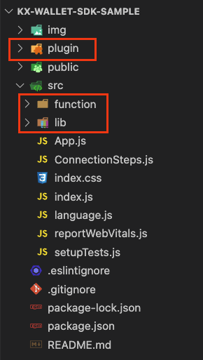

# KX Wallet SDK Sample

This is a sample frontend that demonstrates how to integrate your DApp with the KeyXentic token (KX token).

## Run the Sample Page

1. Make sure you're using Node version 14 or 16. We cannot ensure correct functioning of the program with any other version of Node.
2. Enter the following command in the command line to install the package: `npm install`
3. Enter the following command to start the program: `npm start`
4. You will see the port that the program is occupying in the terminal log. Usually, it's port `3000`. Access the page via Chrome browser with the URL: `http://localhost:{port}`
5. Follow the instruction on the page and play through it as you wish.

## Develop Your Own Application

### Setting Up and importing the SDK

Before you can use any of the functions in your own application, you'll need to set up the SDK.

1. Copy the SDK plugin, library, and functions to your project.

   You'll need to copy the following folders:

   - `/plugin/*`
   - `/src/function/*`
   - `/src/lib/*`

   Please note that you need to follow the folder structure to ensure that the code can recognize the file positions. Otherwise, you might need to adjust the file paths in the import method yourself.

   

2. Set up the dependency.

   Please refer to the `package.json` file and setup the dependency as follows:

   ```
   "kxeth-util": "file:./plugin/KXWebSDK-plugin"
   ```

3. Add the plugin and library to `.eslintignore`.

   Please refer to the `.eslintignore` file if you have enable eslint code checking tool.

   ```
      // In .eslintignore file, add the following lines.
      src/lib/external/*
      KXSEAPDUKit.js
   ```

4. After gathering all the necessary files, run `npm install` to make your project recognize the plugin utilities.

### Explanation of Methods

To use the KX token for signing data, you need to follow several steps before signing. In your application, make sure you call the functions in the correct order.

All the following methods are located in [/function/kxUtil.js](./src/function/kxUtil.js). Please check the input and output content by looking at the methods' code. There are also some comments in the code that could help you implement your code.

1. Connect to the token.

   - Method: `initialKeyToken`
   - Usage: Initialize the key token connection.

2. Login to the token using fingerprint.

   - Method: `loginToKeyTokenUsingFingerprint`
   - Usage: Ask the user to use their fingerprint to login and unlock the token.
   - Notice: You may need to warn the user to set up the fingerprint on KX-Tool.

3. Get the ECC key list.

   - Method: `getECCKeyList`
   - Usage: This method will help you list all the key in the token. You will probably need to create a dropdown menu to let the user choose one of the keys to use.

4. Save the ECC key that the user chooses.

   - Method: `setSelectKeyObj(key)`
   - Usage: This is just a demonstration of one of the ways to save the selected key object. In the sign method, you will need this object to sign the message.

5. Obtain the address.

   - Method: `obtainAddress`
   - Usage: Convert the selected key to an address.

6. Sign the message.

   - Method: `signData(message)`
   - Usage: Sign the message, and it will result in an Ethereum r,s,v signature.
   - Notice: This method will use the key object that the user chose in method 3 and saved by method 4. If you are implementing your own key-saving method, please ensure that the `signData` method can access the key. You may check the implementation details in the function on how the key object is used to sign data.

### Other Instruction

- If the user disconnects the token from the PC during the process, you will need to guide them to reconnect the token again.

- A better way to save and read the key object is to save the key index and key label in your application. Then, every time you need to sign the data, you may just call the `getECCKeyList` method, loop through the key list, and match the key index and key label to find out the one user has chosen. This can be used to prevent the application from losing the key object, and you will not have to make the user re-select the key again.
- You may check the signature result via the validation link created on the sample page to see if the recovered address in the validation page matches the address of the token.
